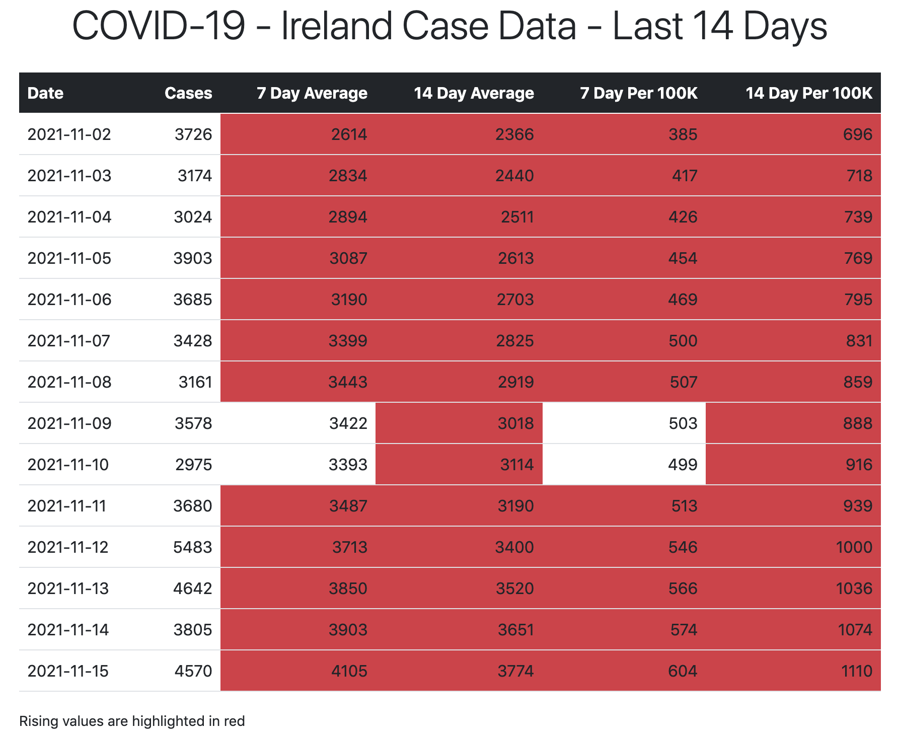
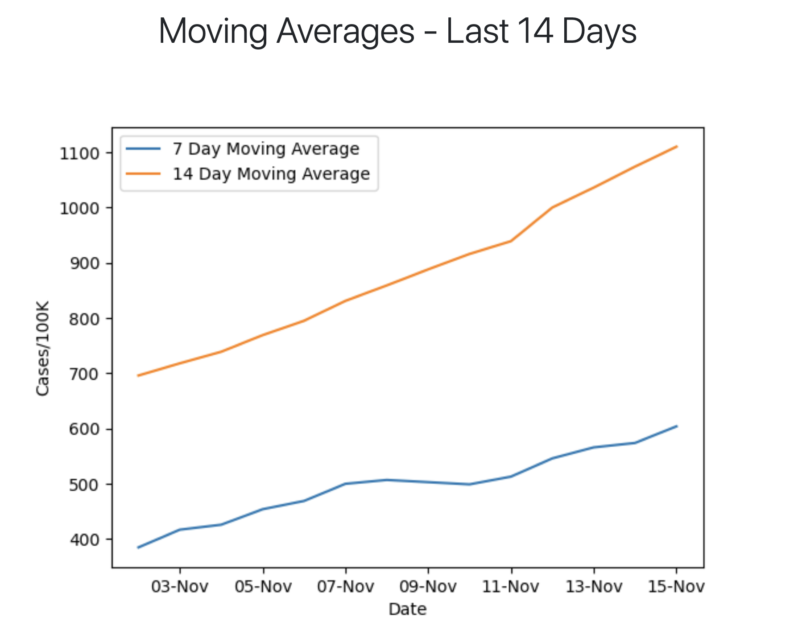

# COVID-19 - Ireland Case Data

The Irish government has made available several datasets relating to the COVID-19 pandemic. These are available at the <a title="Ireland's COVID-19 Data Hub" href="https://covid-19.geohive.ie/" target="_blank">Ireland's COVID-19 Data Hub</a>.

This example looks at how you can download and produce visualisations of the daily case numbers using a Python script. The output from the script is a HTML file (covid-19-ie-cases.html) containing a table of cases with calculated 7 and 14 day averages over the last 14 days and a plot of those values.

